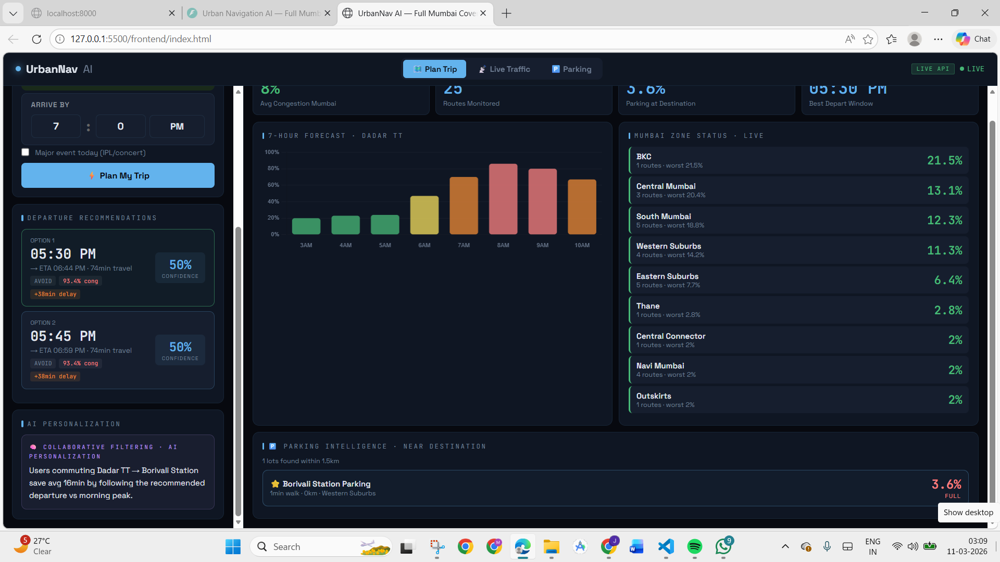
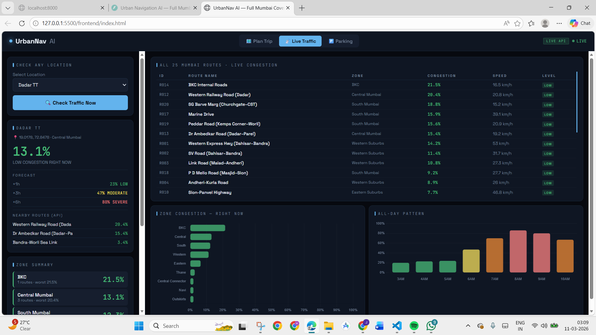
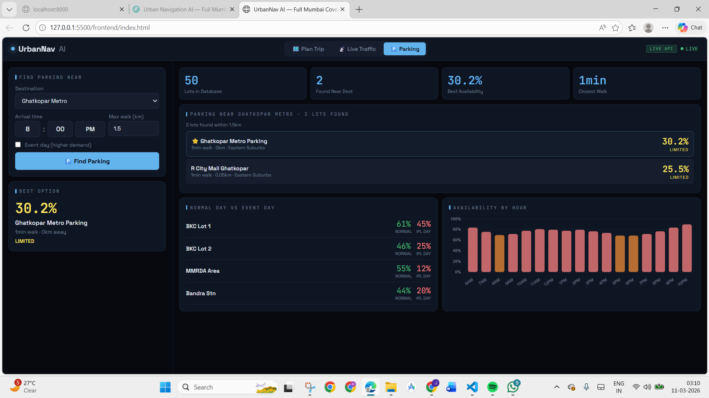

<div align="center">

# UrbanNav AI
### AI-Driven Predictive Urban Navigation and Mobility Optimization System

[](https://python.org)
[](https://fastapi.tiangolo.com)
[](https://pytorch.org)
[](LICENSE)

Built at HORIZON 1.0 — VCET, Vasai Road

</div>

---

## Table of Contents

- [Problem Statement](#problem-statement)
- [Solution Overview](#solution-overview)
- [Screenshots](#screenshots)
- [Tech Stack](#tech-stack)
- [System Architecture](#system-architecture)
- [Data Pipeline](#data-pipeline)
- [ML Models](#ml-models)
- [API Endpoints](#api-endpoints)
- [Project Structure](#project-structure)
- [Getting Started](#getting-started)

---

## Problem Statement

Urban commuters in Mumbai face daily mobility challenges that existing navigation tools cannot fully address:

| Problem | Impact |
|---|---|
| Unpredictable traffic congestion | 91 hours lost per commuter per year (INRIX 2023) |
| No advance departure guidance | Commuters leave at wrong times, hitting peak traffic |
| Reactive-only navigation apps | Apps like Google Maps react after congestion forms, not before |
| Parking uncertainty | Commuters waste 15-20 minutes searching for available spots |
| No unified mobility view | Weather, events, routes, and parking exist as separate silos |

Every existing navigation system is reactive. UrbanNav AI is predictive — it tells you what will happen hours before it does.

---

## Solution Overview

UrbanNav AI is a full-stack predictive mobility platform with four integrated modules:

- **Traffic Forecasting** — LSTM neural network predicts congestion up to 7 hours ahead across 25 Mumbai routes
- **Smart Departure Planning** — Evaluates 18 departure windows and recommends the optimal time to leave relative to your arrival target
- **Parking Intelligence** — Statistical model predicts availability across 50 Mumbai parking lots before you arrive
- **Personalized Learning** — Collaborative filtering builds on user trip history to surface personalized departure and route preferences

---

## Screenshots

### Plan Trip — Departure Recommendations


### 7-Hour Traffic Forecast



### Live Traffic — All 25 Routes



### Parking Intelligence



---

## Tech Stack

### Backend

| Technology | Version | Purpose |
|---|---|---|
| Python | 3.10+ | Core language |
| FastAPI | 0.104+ | REST API framework |
| Uvicorn | 0.24+ | ASGI server |
| PyTorch | 2.0+ | LSTM neural network training and inference |
| NumPy | 1.24+ | Numerical computation |
| Pandas | 2.0+ | Data processing and feature engineering |
| scikit-learn | 1.3+ | StandardScaler and preprocessing utilities |
| SQLite | built-in | User profiles and trip history storage |

### Frontend

| Technology | Purpose |
|---|---|
| HTML5 / CSS3 | Dashboard layout and styling |
| Vanilla JavaScript | Client-side logic, API calls, state management |
| Chart.js 4.4 | Congestion forecast bar charts and zone comparisons |

---

## System Architecture

```
                        CLIENT (Browser)
          ┌──────────────┬──────────────┬────────────────┐
          │  Plan Trip   │ Live Traffic │    Parking     │
          │     Tab      │     Tab      │      Tab       │
          └──────┬───────┴──────┬───────┴───────┬────────┘
                 └──────────────┴───────────────┘
                                │ HTTP / REST
                                ▼
               FastAPI Backend  (localhost:8000)
          ┌─────────────────────────────────────────────┐
          │  /api/forecast/*                            │
          │  /api/departure/plan                        │
          │  /api/parking/*                             │
          │  /api/users/*                               │
          └───────────────────┬─────────────────────────┘
                              │
          ┌───────────────────▼─────────────────────────┐
          │               Core ML Layer                  │
          │                                              │
          │  predictor.py        departure_planner.py   │
          │  Statistical         18-window scorer        │
          │  additive model                              │
          │                                              │
          │  parking_intelligence.py  personalization.py │
          │  Statistical occupancy    Collaborative       │
          │  predictor                filtering          │
          │                                              │
          │  lstm_traffic.py  (optional, if trained)     │
          │  PyTorch LSTM     multi-horizon forecast      │
          └───────────────────┬─────────────────────────┘
                              │
          ┌───────────────────▼─────────────────────────┐
          │              mumbai_routes.py                │
          │  25 routes, 50 parking lots, 9 zones        │
          │  Haversine nearest-route/lot lookup          │
          └──────────────────────────────────────────────┘

          ┌─────────────────┐    ┌──────────────────────┐
          │ SQLite          │    │ OpenWeatherMap API   │
          │ urban_nav.db    │    │ (optional, .env key) │
          └─────────────────┘    └──────────────────────┘
```

### Request Flow — POST /api/departure/plan

```
User submits: origin, destination, lat/lng, arrival_hour,
              distance_km, has_event

nearest_routes(origin_lat, origin_lng)
  └── finds closest route from 25 options using haversine distance

Build 18 departure windows (every 10 min, across 3-hour search range):
  For each window:
    predict_congestion(route_id, hour, dow, weather_code, has_event)
    _travel_minutes(congestion, distance_km, base_speed)
    _score(congestion, buffer_min, delay_min, normal_min)

Normalise scores: worst window = 52, best window = 97
Pick top 3 windows spread at least 20 min apart
Sort by score descending (rank 1 = best)

Return: recommendations[3], all_windows[18], search_window
```

---

## Data Pipeline

### Stage 1 — Synthetic Data Generation

File: `data/generate_synthetic_data.py`

Generates 60 days x 25 routes x 24 hours = 36,000 records.

Each record contains:

| Column | Description |
|---|---|
| timestamp | datetime of observation |
| route_id | R001–R025 |
| zone | one of 9 Mumbai zones |
| road_type | expressway / highway / arterial / local |
| hour | 0–23 |
| day_of_week | 0 (Monday) – 6 (Sunday) |
| congestion_pct | 0–100, target variable |
| speed_kmh | derived from congestion |
| weather_code | 0=clear, 1=rain, 2=storm, 3=fog |
| has_event | boolean (IPL, concerts, local festivals) |

Realism factors applied during generation:

- Mumbai peak hours modelled: 7–10 AM and 5–9 PM
- Zone multipliers: BKC 1.25x, Navi Mumbai 0.80x
- Road type scaling: expressway = 0.45x arterial congestion
- Weekend reduction: Saturday -18 pts, Sunday -28 pts
- Monsoon storm impact: +28 congestion points
- Event uplift: +20 to +30 pts in event-adjacent zones
- Gaussian noise added per record for variation

Output: `data/processed/mumbai_traffic_history.csv`

### Stage 2 — Feature Engineering (LSTM only)

File: `backend/models/lstm_traffic.py` — `build_features()`

| Feature | How it is created |
|---|---|
| hour_sin, hour_cos | Cyclic encoding: sin/cos(2*pi*hour/24) |
| dow_sin, dow_cos | Cyclic encoding: sin/cos(2*pi*dow/7) |
| congestion_pct | StandardScaler: mean=0, std=1 |
| weather_code | Raw integer 0–3 |
| has_event | Boolean cast to float |
| zone_encoded | LabelEncoder |
| road_type_encoded | LabelEncoder |

Total features per timestep: 7

### Stage 3 — Sequence Creation (LSTM only)

Sliding window over time-sorted records:

```
Input  X: [batch, seq_len=24, features=7]   last 24 hours as context
Target y: [batch, 3]                         congestion at +1h, +3h, +6h
```

Train / Val split: 85% / 15%, time-based (not random). Time-based split prevents data leakage — the validation set only contains records that come after all training records chronologically.

### Stage 4 — Inference

Two parallel prediction paths:

**Path A — Statistical Predictor** (always active, no training required):

```python
pct = HOURLY_BASE[hour] * TYPE_SCALE[road_type] * 100
    + ZONE_ADD[zone]           # BKC: +10, Navi Mumbai: -8
    + DAY_ADJUST[day_of_week]  # Monday: +8, Saturday: -18, Sunday: -28
    + ROUTE_OFFSET[route_id]   # per-route calibration
    + WEATHER_ADD[weather]     # rain: +12, storm: +28, fog: +10
    + EVENT_ADD                # +28 if event and high-impact zone

congestion = clip(pct, 2, 97)
```

**Path B — LSTM Predictor** (active only if `lstm_traffic.pt` exists after training):

Loads saved PyTorch model and StandardScaler, feeds 24-hour sequence, outputs +1h / +3h / +6h congestion simultaneously.

---

## ML Models

### Model Inventory

| # | Model | File | Type | Training Origin | Purpose |
|---|---|---|---|---|---|
| 1 | LSTM Neural Network | `lstm_traffic.py` | PyTorch | Trained from scratch on synthetic Mumbai data | Multi-horizon traffic congestion forecasting |
| 2 | Statistical Additive Predictor | `predictor.py` | Rule-based | No training — deterministic formula | Real-time congestion for any route, time, and condition |
| 3 | Statistical Parking Predictor | `parking_intelligence.py` | Rule-based | No training — deterministic formula | Parking availability across 50 lots |
| 4 | Departure Window Scorer | `departure_planner.py` | Scoring | No training — weighted scoring function | Rank 18 departure windows by congestion and arrival timing |
| 5 | Collaborative Filter | `personalization.py` | Cosine similarity | No training — computed at query time from trip history | User personalization from trip history |

---

### Model 1 — LSTM Traffic Forecaster

**Training origin: trained from scratch**

No pretrained weights are used. The model is initialised with random weights and trained entirely on our synthetic Mumbai traffic dataset using `python -m backend.models.lstm_traffic`. The trained weights are saved to `backend/models/saved/lstm_traffic.pt`.

**Architecture:**

```
Input      [batch, seq_len=24, features=7]
    |
LSTM L1    hidden_size=128, num_layers=2, dropout=0.2
    |
LSTM L2    hidden_size=128
    |
Attention  Linear(128->64) -> Tanh -> Linear(64->1) -> Softmax
           weighted sum across the 24 input timesteps
    |
FC L1      Linear(128->64) + ReLU + Dropout(0.2)
    |
FC L2      Linear(64->3)
    |
Output     [congestion_+1h, congestion_+3h, congestion_+6h]
```

**Training configuration:**

| Parameter | Value |
|---|---|
| Sequence length | 24 hours |
| Input features | 7 |
| Hidden size | 128 |
| LSTM layers | 2 |
| Dropout | 0.2 |
| Batch size | 64 |
| Epochs | 30 |
| Learning rate | 0.001 |
| Optimizer | Adam, weight_decay=1e-5 |
| Loss function | HuberLoss |
| LR Scheduler | ReduceLROnPlateau, patience=3, factor=0.5 |
| Train/Val split | 85% / 15%, time-based |

**Evaluation metrics:**

The training loop computes and prints MAE at each epoch using `sklearn.metrics.mean_absolute_error` on the validation set, separately for each horizon. The metric logged is:

```
MAE 1h: X.X   MAE 3h: X.X   MAE 6h: X.X
```

These are printed to the terminal during `python -m backend.models.lstm_traffic`. The values depend on the machine and the generated dataset — run the training script to see the actual numbers from your environment. The model checkpoint saved to `lstm_traffic.pt` corresponds to the epoch with the lowest validation HuberLoss.

MAE here is in percentage points — a MAE of 10 means the prediction is off by 10 congestion percentage points on average. Because this is synthetic data, the model learns the patterns very well. Expect lower MAE at the 1-hour horizon and higher at 6 hours since uncertainty increases with distance.

**Why LSTM:** Traffic is a time series where current congestion depends on the previous several hours. LSTM's gating mechanism (forget, input, output gates) learns which historical timesteps are relevant for each forecast horizon. A feedforward model treats each hour independently and misses these temporal patterns.

**Why HuberLoss:** Traffic data contains genuine outliers such as accidents and sudden events. Mean squared error penalizes these quadratically and distorts the learned weights. HuberLoss is quadratic for small errors and linear for large ones, giving stable gradients without ignoring real anomalies.

---

### Model 2 — Statistical Additive Predictor

**Training origin: no training, no model file**

This is a hand-calibrated formula. There are no weights, no training data consumed, and no `.pt` or `.pkl` file generated. It runs at API startup immediately and is always available regardless of whether the LSTM has been trained.

**Formula:**

```
pct = HOURLY_BASE[hour] * TYPE_SCALE[road_type] * 100
    + ZONE_ADD[zone]
    + DAY_ADJUST[day_of_week]
    + ROUTE_OFFSET[route_id]
    + WEATHER_ADD[weather_code]
    + EVENT_ADD (if applicable)

congestion = clip(pct, 2, 97)
```

**Why additive, not multiplicative:** An earlier multiplicative version stacked zone, type, and day multipliers. At BKC during Monday peak this produced `0.78 * 1.25 * 1.30 * 1.12 = 1.42`, which clips to 100 for almost every high-demand combination, making all predictions indistinguishable. The additive model keeps values in the realistic 2–97 range across all conditions.

---

### Model 3 — Statistical Parking Predictor

**Training origin: no training, no model file**

Like Model 2, this is a calibrated formula with hardcoded multipliers — no sklearn, no `.pkl`, no training loop. The word "predictor" here means it produces a forward-looking estimate, not that it uses a trained ML model.

**Occupancy formula:**

```
occupancy = HOURLY_OCC[hour]
          * ZONE_PARK_MULT[zone]      # BKC: 1.30, Navi Mumbai: 0.80
          * LOT_TYPE_MULT[lot_type]   # station: 1.20, airport: 0.70
          + weather_adjustment        # rain reduces driving
          + event_adjustment          # IPL/concert adds demand
          + capacity_adjustment       # large lots fill more slowly
          + deterministic_noise       # per lot-id hash, stable per request

availability_pct = clip((1 - occupancy) * 100, 0, 100)
```

Lot types recognized: airport, mall, hospital, station, default.

---

### Model 4 — Departure Window Scorer

**Training origin: no training**

Pure algorithmic scoring. The weights (0.40 timing, 0.35 congestion, 0.25 delay) were manually set. No data was used to fit them.

**Scoring formula per window:**

```
raw = 0.40 * timing_score      # 5-20 min early = 100, late = 0
    + 0.35 * congestion_score  # (1 - congestion/100) * 100
    + 0.25 * delay_score       # (2.0 - delay_ratio) * 100

normalised = 52 + (raw - raw_min) / (raw_max - raw_min) * 45
```

Normalisation maps the lowest-scoring window in the search to 52 and the best to 97. Without this, all peak-hour windows score in the 20–40 range and no clear recommendation emerges.

---

### Model 5 — Collaborative Filter

**Training origin: no offline training — computed live from SQLite**

There is no training phase. When `/api/users/{id}/similar` is called, the system reads all user trip records from SQLite, builds feature vectors on the fly, computes cosine similarity at query time, and returns the top matches. It improves automatically as more trips are logged — no retraining needed.

**Method:** User-User Cosine Similarity

**Feature vector per user (6 dimensions):**

```
[ avg_departure_hour, avg_congestion_tolerance,
  preferred_route_encoded, avg_travel_minutes,
  avg_parking_walk_tolerance, trip_frequency ]
```

Users with cosine similarity above 0.7 are surfaced as similar commuters. Their preferred departure times and routes are used to generate personalized suggestions for new users on the same corridor.

---

## Evaluation

### What is measured and what is not

Only the LSTM (Model 1) has a formal training loop with computed metrics. The other four models are either rule-based formulas or a live similarity computation — there are no train/test splits, no loss functions, and no numeric evaluation metrics for them.

### LSTM — metrics computed during training

The training script (`lstm_traffic.py`) computes these on the validation set at every epoch:

| Metric | What it measures | Where it is computed |
|---|---|---|
| HuberLoss (val) | Overall validation loss, used for model checkpointing | `criterion(pred, yb)` in the training loop |
| MAE 1h | Mean absolute error for the +1 hour forecast, in congestion percentage points | `mean_absolute_error(trues[:, 0], preds[:, 0])` |
| MAE 3h | Same for +3 hour forecast | `mean_absolute_error(trues[:, 1], preds[:, 1])` |
| MAE 6h | Same for +6 hour forecast | `mean_absolute_error(trues[:, 2], preds[:, 2])` |

These are printed to the terminal during training. To see the actual values from your environment, run:

```bash
python -m backend.models.lstm_traffic
```

The model saved to `lstm_traffic.pt` is the checkpoint from the epoch with the lowest `val_loss`, not necessarily the last epoch.

### Why there are no pre-logged metric numbers in this README

The metrics depend on the generated dataset, which uses a random seed and produces slightly different values each time it is generated. Putting fixed numbers here would mean they do not match what you see when you train. Run the training script and the terminal will print the actual MAE at each epoch.

### What MAE means in this context

MAE is in percentage points of congestion. A MAE of 8 at the 1-hour horizon means the model's prediction is off by 8 congestion percentage points on average. Since the target range is 2–97, an 8-point error is meaningful but not catastrophic — it correctly classifies the severity band (LOW / MODERATE / HIGH / SEVERE) in most cases.

---

## API Endpoints

### Traffic

| Method | Endpoint | Description |
|---|---|---|
| GET | /api/forecast/all-routes | Congestion for all 25 routes |
| GET | /api/forecast/zones | Summary across all 9 zones |
| GET | /api/forecast/by-location?lat=&lng= | Predictions for any Mumbai coordinates |
| GET | /api/forecast/area-comparison | Side-by-side comparison of 8 key areas |
| GET | /api/forecast/{route_id} | Full forecast for a specific route R001–R025 |
| GET | /api/weather | Current Mumbai weather with congestion impact code |

### Trip Planning

| Method | Endpoint | Description |
|---|---|---|
| POST | /api/departure/plan | Ranked departure recommendations |

### Parking

| Method | Endpoint | Description |
|---|---|---|
| POST | /api/parking/predict | Availability near destination coordinates |
| GET | /api/parking/lots?zone= | All 50 lots, filterable by zone |
| GET | /api/parking/by-location?lat=&lng= | Parking near any Mumbai coordinates |

### Routes and Users

| Method | Endpoint | Description |
|---|---|---|
| GET | /api/routes?zone= | All 25 routes, filterable by zone |
| GET | /api/nearest-routes?lat=&lng= | Closest routes to a coordinate |
| POST | /api/users/create | Create a user profile |
| GET | /api/users/{id}/profile | Profile and personalized insights |
| POST | /api/users/log-trip | Log a completed trip |
| GET | /api/users/{id}/similar | Find similar commuters |

Interactive API docs: `http://localhost:8000/docs`

---

## Project Structure

```
urban_nav/
|
|-- start.py                          run this to start the API server
|-- setup_and_run.py                  first-time setup: install, generate data, train, start
|-- test_all_apis.py                  test suite for all endpoints
|-- requirements.txt
|-- .env                              API keys (OpenWeather, TomTom)
|-- README.md
|
|-- screenshots/                      dashboard screenshots (referenced in README)
|
|-- data/
|   |-- generate_synthetic_data.py    generates 36,000-record Mumbai dataset
|   `-- processed/
|       `-- mumbai_traffic_history.csv
|
|-- backend/
|   |-- api/
|   |   `-- main.py                   FastAPI application, 15+ endpoints
|   |
|   |-- models/
|   |   |-- predictor.py              statistical additive predictor (Model 2)
|   |   |-- lstm_traffic.py           PyTorch LSTM architecture and training (Model 1)
|   |   |-- parking_intelligence.py   statistical parking predictor (Model 3)
|   |   |-- personalization.py        SQLite schema and collaborative filtering (Model 5)
|   |   |-- mumbai_routes.py          master data: 25 routes, 50 lots, haversine lookup
|   |   `-- saved/
|   |       |-- lstm_traffic.pt       trained LSTM weights, generated on first train run
|   |       `-- scaler.pkl            StandardScaler fitted on training data
|   |
|   `-- services/
|       |-- departure_planner.py      18-window departure scorer (Model 4)
|       |-- weather_service.py        OpenWeatherMap API integration
|       `-- tomtom_collector.py       optional live traffic data collector
|
`-- frontend/
    `-- index.html                    complete single-file dashboard
```

---

## Getting Started

### Prerequisites

- Python 3.10 or higher
- Approximately 500 MB free disk space for PyTorch

### Quick Start

```bash
git clone https://github.com/your-username/urban-nav-ai.git
cd urban-nav-ai/urban_nav

pip install -r requirements.txt

python start.py
```

Open `frontend/index.html` in your browser.

- API server: `http://localhost:8000`
- Interactive API docs: `http://localhost:8000/docs`

The system works immediately without training. The statistical predictor (Model 2) runs at startup with no model files required.

### First-Time Full Setup (includes LSTM training)

```bash
python setup_and_run.py
```

This will:
1. Install all dependencies
2. Generate the 36,000-record synthetic dataset
3. Train the LSTM model (approximately 5 minutes on CPU)
4. Seed the database with three demo users and trip history
5. Start the API server

### Train the LSTM Separately

```bash
python -m backend.models.lstm_traffic
```

Trained model saves to `backend/models/saved/lstm_traffic.pt`.

### Run the API Test Suite

```bash
python test_all_apis.py
```

---

## Mumbai Coverage

| Category | Count |
|---|---|
| Routes monitored | 25 |
| Zones covered | 9 |
| Parking lots | 50 |
| Training records | 36,000 |
| Forecast horizon | 7 hours |
| Departure windows evaluated per request | 18 |

Zones: Western Suburbs, Eastern Suburbs, Central Mumbai, BKC, South Mumbai, Thane, Central Connector, Navi Mumbai, Outskirts

---

## Requirements

```
fastapi
uvicorn[standard]
torch
numpy
pandas
scikit-learn
requests
geopy
python-dotenv
schedule
pydantic
```

---

<div align="center">

UrbanNav AI — HORIZON 1.0 — VCET Vasai Road

</div>
